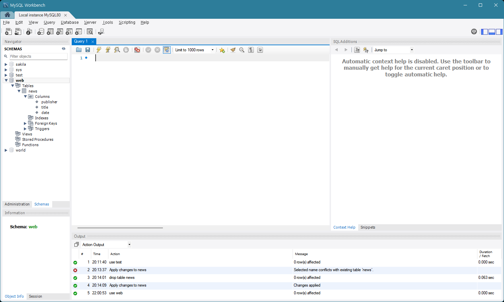
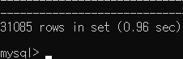
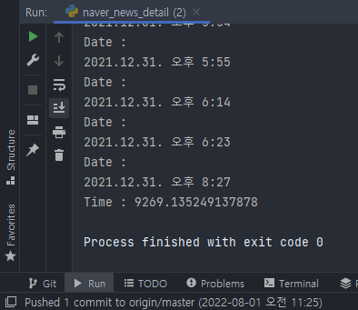

# __2022 Summer Data Study__
## 2022년 여름방학 데이터 스터디
>\# [2022_07_22](#2022_07_22)  
>\# [2022_07_23](#2022_07_23)  
>\# [2022_07_29](#2022_07_29)  
>\# [2022_07_31](#2022_07_31)  
>\# [2022_08_05](#2022_08_05)
***
- ### ___2022_07_22___
    #### 📌 BeautifulSoup 라이브러리를 이용하여 7월 1일자의 모든 뉴스 수집 📌

    네이버 뉴스 주소를 request로 요청하였을 때 오류가 발생
    서버에서 사용자 소프트웨어의 식별 정보인 User-Agent 없이 HTTP 요청을 하면 오류가 발생
    User-Agent 값을 포함하는 header 추가하여 오류 해결 (크롬 사용)
    ```python
    headers = {'User-Agent': 'Mozilla/5.0 (Windows NT 6.3; Win64; x64) AppleWebKit/537.36 (KHTML, like Gecko) Chrome/63.0.3239.132 Safari/537.36'}
    res = requests.get(URL, headers=headers)
    ```

    해당 날짜의 첫번째 페이지 URL과 그 페이지 하단의 페이지 번호 리스트의 url을 page 리스트에 append
    ```python
    page = ['https://news.naver.com/main/list.naver?mode=LS2D&mid=shm&sid2=229&sid1=105&date=20220701']
    for li in soup.select('#main_content > div.paging > a'):
        page.append('https://news.naver.com/main/list.naver' + li['href'])
    ```
    page 리스트 안의 페이지에 있는 뉴스 리스트를 바로 for문으로 돌리는 '페이지 탐색' for문 사용
    ```python
    for li in soup.select('#main_content > div > ul > li'):
        url = li.a['href']
    ```

    리스트 l에 '페이지 탐색' for문으로 얻은 title, date, contents 데이터를 리스트로 묶어 append한 후 for문 종료 후 pandas를 이용하여 DataFrame으로 정리하고 엑셀(naver_news.xlsx)로 저장
    ```python
    l.append([title, date, contents])
    .
    .
    .
    df = pd.DataFrame(l, columns = ['title', 'url', 'contents'])
    df.to_excel('naver_news.xlsx', index = False) 
    ```
***
- ### ___2022_07_23___
    #### 📌 6월 한 달치 뉴스 수집 📌
    
    6월 한 달이 30일인걸 반영하여 for, range문으로 30일치 뉴스 url을 만들어 day_url 리스트에 append
    ```python
    for day in range(30):
    day_url.append('https://news.naver.com/main/list.naver?mode=LS2D&mid=shm&sid2=229&sid1=105&date='+ str(20220601 + day))
    ```
***
- ### ___2022_07_29___
    #### 📌 title과 date 수집 방식 변경 📌
    
    기존에는 뉴스 개별 페이지 안에서 title과 date를 수집
    이 과정에서 언론사마다 selector가 달라서 그 종류를 모두 찾은 후 try, except문으로 처리 ([2022_08_05](#2022_08_05) 참고)
    ```python
    #title
    try :
        title = soup.select_one('#ct > div > div > h2').text.strip()
    except:
        title = soup.select_one('#content > div > div > div > div > h4').text.strip()
    #date
    try:
        date = soup.select_one('#ct > div > div > div > div > span').text.strip()
    except:
        date = soup.select_one('#content > div > div> div > div> div > span').text.strip()
        if date == '새로운 뉴스':
            date = soup.select_one('#content > div.end_ct > div > div.article_info > span > em').text.strip()
        else:
            list(date)
            date = date[5:]
            str(date)
    ```

    위의 방식으로 처리하면 더 많은 뉴스 기사를 수집할 때 문제가 발생할 가능성이 있고 효율적이지 못하기에 뉴스 개별 페이지가 아닌 뉴스 리스트가 보이는 페이지에서 기본 정보를 수집하도록 수정 (그러나 페이지 내부에서 수집하는 contents 항목은 아직 수정하지 못함)
    ```python
    def basic_info(li):
        url = li.a['href']
        for t in li.select('#main_content > div > ul > li > dl > dt > a'):
            title = t.text.strip()
        date = li.select_one('#main_content > div > ul > li > dl > dd > span.date').text.strip()

        return title, date, url
    ```
***
- ### ___2022_07_31___
    #### 📌 MySQL에 데이터 정리 📌
    
    ###### _# MySQL에 data를 넣은 img_
    

    ###### _# MySQL Workbench로 스키마, 테이블을 생성한 img_
    

    엑셀의 행의 한계는 1048576개이기 때문에 방대한 데이터를 저장하기에 무리가 있어 데이터베이스를 사용
    MySQL에 web 스키마를 생성, news 테이블 생성, publisher, title, date 필드 생성
    ```sql
    CREATE DATABASE web

    USE web

    CREATE TABLE `test`.`news` (
        `publisher` VARCHAR(20) NOT NULL,
        `title` VARCHAR(100) NOT NULL,
        `date` VARCHAR(30) NOT NULL);
    ```

    python으로 데이터베이스를 사용하기 위하여 pymysql 라이브러리를 사용
    ```
    pip install PyMySQL
    ```

    MySQL에 연결할 때 필요한 db, host, user, password, port, charset 정보를 딕셔너리형으로 mysql_user_info.py로 미리 저장하였다가 naver_news_detail.py에서 import 하여 사용
    ```python
    # mysql_user_info.py
    user_info = {'db' : 'web', 'host' : '127.0.0.1', 'user' : 'root', 'passwd' : 'DB_PASSWORD', 'port' : 3306, 'charset' : 'utf8'}
    ```

    ```python
    import mysql_user_info
    ```

    with as문을 이용하여 close()문을 사용하지 않아도 됨
    ```python
    def insert_data(publisher, title, date):
    user = mysql_user_info.user_info
    db = pymysql.connect(db=user['db'], host=user['host'], user=user['user'], passwd=user['passwd'], port=user['port'], charset=user['charset'])

    sql = 'INSERT INTO news (publisher, title, date) VALUES (%s, %s, %s)'

    with db:
        with db.cursor() as cursor:
            cursor.execute(sql, (publisher, title, date))
            db.commit()
    ```

    time 라이브러리를 이용하여 코드 실행시간 측정
    (6월 한 달치를 contents를 함께 수집하면 약 10분 정도 소요, contents를 수집 안하였을 때 68.97558355331421초 소요)
    ```python
    import time

    start_time = time.time()
    .
    .
    .
    print(f'Time : {time.time() - start_time}')
    ```
***
- ### ___2022_08_05___
    #### 📌 2021년 1년치 뉴스 데이터 수집 📌

    ###### _# MySQL에 1년 치 data가 들어가 있는 img_
    

    ###### _# 약 2시간 반 소요된 img_
    
    
    2021년 1년치 데이터를 수집하기 위하여 1년치 링크를 day_url 리스트에 append
    ```python
    # 날짜 리스트 만들기
    month_day = [31, 28, 31, 30, 31, 30, 31, 31, 30, 31, 30, 31]
    day_url = []
  
    for month in range(12):
        for day in range(month_day[month]):
            day_url.append(('https://news.naver.com/main/list.naver?mode=LS2D&mid=shm&sid2=229&sid1=105&date=' + str(20210000 + (month + 1) * 100 + (day + 1))))
    ```
    
    [2022_07_29](#2022_07_29) 에 수정하지 못하였던 contents 항목 데이터 수집 방식 변경  
    언론사마다 selector가 다른 것이 아닌 네이버 뉴스의 일반 뉴스, 연예 뉴스, 스포츠 뉴스마다 다른 것을 인지하고 수정
    ```python
    # contents
    try:
        contents = soup.select_one('#dic_area').text.strip()
    except:
        if soup.select_one('#header > div > div > h1 > a:nth-of-type(2)').text == '스포츠':
            contents = soup.select_one('#newsEndContents').text.strip()
        elif soup.select_one('#header > div > div > h1 > a:nth-of-type(2)').text == 'TV연예':
            contents = soup.select_one('#content > div.end_ct > div > div.end_body_wrp').text.strip()
    ```
    
    특정 날짜의 특정 페이지에서만 데이터 수집이 안되는걸 발견  
    하루동안 고민 후 교수님께 질문을 하였고 셀레니움을 이용해서 수정이 가능하다는 답변을 얻음  
    이번에는 셀레니움 없이 수집할 것이기 때문에 예외 처리 하도록 수정
    ```python
    try:
        title, date, publisher, url = basic_info(li)
        contents = detail_info(url)

        print(f'Date : \n{date}')

        insert_data(publisher, title, date, contents)

    except:
        continue
  ```